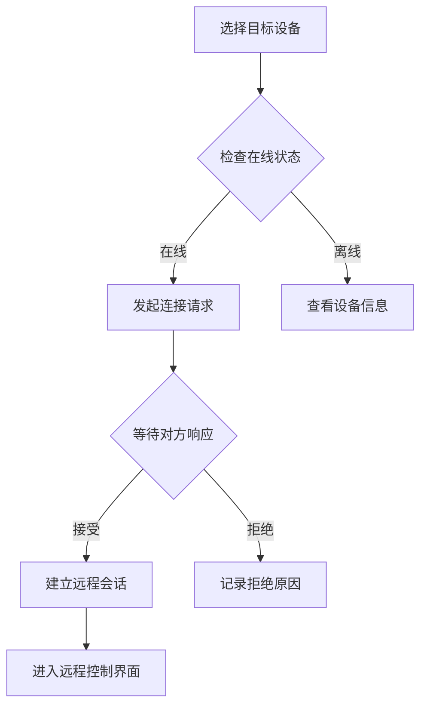

# 远程桌面值守桌面客户端 - 产品需求文档

## 1. 产品概述

面向小型门店总部的远程桌面协助系统，用于远程连接和协助收银机、排队屏和办公电脑。解决门店IT运维效率低、设备分散难以统一管理的问题，为总部运维人员提供一站式的远程控制解决方案。

目标用户：小型连锁门店总部运维人员、技术支持团队、IT管理人员

## 2. 核心功能

### 2.1 用户角色
| 角色 | 职责 | 核心权限 |
|------|------|---------|
| 运维管理员 | 设备管理、远程控制、配置系统 | 全部功能 |
| 技术支持人员 | 使用远程控制、记录会话、投递文件 | 设备列表、远程控制、会话记录、文件投递 |

### 2.2 功能模块
1. **设备列表模块**：统一管理所有门店设备，按门店、在线状态、备注筛选，支持一键连接
2. **远程控制模块**：实时查看远程屏幕，支持多屏切换、清晰度调整、快捷键操作、输入锁定、截图标注、剪贴板同步
3. **会话记录模块**：记录每次连接的详细信息，支持问题标签、备注管理
4. **文件投递模块**：支持拖拽上传安装包、导出设备日志、批量文件管理
5. **设置模块**：配置安全策略、连接参数、授权管理等

## 3. 核心流程

### 3.1 远程连接流程

### 3.2 会话管理流程

## 4. 页面设计

### 4.1 设备列表页面

#### 页面结构
- **顶部导航栏**：Logo、用户信息、通知入口
- **侧边栏**：五个主要功能入口（设备列表、远程控制、会话记录、文件投递、设置）
- **主内容区**：
  - 筛选工具栏（门店选择、在线状态、备注搜索）
  - 设备卡片列表（支持网格/列表视图切换）
  - 一键连接按钮
- **状态指示**：在线/离线/忙碌状态灯

#### UI元素设计
- **配色方案**：主色 #2563EB（专业蓝），辅助色 #10B981（成功绿），警示色 #EF4444（错误红）
- **布局风格**：卡片式布局，左右分栏，清晰的信息层级
- **状态显示**：圆点指示灯，绿色=在线，灰色=离线，橙色=忙碌
- **操作按钮**：圆角矩形，hover时有阴影效果

### 4.2 远程控制页面

#### 页面结构
- **顶部工具栏**：设备信息、连接状态、清晰度切换、快捷操作按钮
- **屏幕显示区**：实时画面展示，支持多屏切换Tab
- **底部控制栏**：常用快捷键、截图、锁屏、同步剪贴板
- **侧边信息栏**：剪贴板内容、同步状态

#### UI元素设计
- **屏幕区域**：深色背景(#1F2937)，最大化显示空间
- **控制按钮**：图标按钮，hover时高亮
- **清晰度选项**：流畅(低带宽)、标准、清晰(高画质)
- **快捷键面板**：下拉菜单，支持常用组合键
- **截图工具**：全屏截图、区域选择、标注工具（箭头、文字、框选）

### 4.3 会话记录页面

#### 页面结构
- **筛选区**：日期范围、操作者筛选、问题标签筛选
- **会话列表**：时间轴展示，连接时长、状态、操作者
- **详情面板**：展开查看完整会话信息
- **统计卡片**：总连接次数、平均时长、成功解决率

#### UI元素设计
- **时间轴**：左侧垂直线连接各会话节点
- **标签系统**：彩色标签区分问题类型（硬件故障、软件问题、网络问题、其他）
- **操作按钮**：查看详情、导出报告、删除记录

### 4.4 文件投递页面

#### 页面结构
- **上传区**：拖拽上传区域，支持批量上传安装包
- **文件列表**：显示已上传文件，状态（待发送、已发送、发送失败）
- **目标设备选择**：勾选需要投递的设备
- **发送记录**：历史投递记录表格

#### UI元素设计
- **拖拽区域**：虚线边框，hover时边框变实线，背景色变化
- **进度条**：文件上传、发送进度可视化
- **文件类型图标**：根据文件类型显示不同图标
- **批量操作**：全选、反选、重试失败项

### 4.5 设置页面

#### 页面结构
- **配置分组**：
  - 安全设置（临时授权码、无人值守开关、黑名单）
  - 连接设置（超时提醒、敏感操作确认）
  - 系统设置（通知偏好、界面定制）
- **表单区域**：开关切换、输入框、下拉选择

#### UI元素设计
- **分组卡片**：带标题的设置卡片，圆角边框
- **开关控件**：滑动开关，带启用/禁用状态
- **输入框**：带标签和验证提示
- **操作日志**：记录所有配置变更

## 5. 功能详细说明

### 5.1 设备列表功能
- **门店筛选**：下拉选择不同门店，支持多选
- **在线状态筛选**：全部/仅在线/仅离线
- **备注搜索**：输入关键词搜索设备备注
- **设备信息**：设备名称、IP地址、门店、备注、在线状态
- **快速操作**：连接、查看详情、编辑备注

### 5.2 远程控制功能
- **多屏查看**：Tab切换不同屏幕，同步显示
- **清晰度切换**：流畅/标准/清晰三档，适应不同网络环境
- **快捷键发送**：Ctrl+Alt+Del、Alt+Tab等常用组合键
- **锁定对方输入**：临时禁用远程键盘鼠标操作
- **截图标注**：全屏截图、区域截图、标注工具（箭头、文字、矩形框）
- **剪贴板同步**：双向同步剪贴板内容

### 5.3 会话记录功能
- **记录信息**：连接开始时间、结束时间、连接时长、操作者、设备信息
- **问题标签**：硬件故障、软件问题、网络问题、配置问题、其他
- **处理备注**：记录问题原因、解决方案、后续建议
- **导出功能**：导出Excel/CSV格式会话报告

### 5.4 文件投递功能
- **拖拽上传**：支持拖拽文件到上传区域
- **文件类型**：安装包（.exe、.msi）、日志文件（.log、.zip）
- **批量投递**：选择多个设备同时发送
- **进度跟踪**：实时显示上传、发送进度
- **历史记录**：记录所有投递操作及状态

### 5.5 设置功能
- **临时授权码**：生成有时限的连接授权码
- **无人值守开关**：启用后可在对方不在线时自动连接
- **黑名单管理**：添加/移除禁止连接的设备
- **连接超时提醒**：设置超时时间，到时提醒
- **敏感操作确认**：远程控制、文件投递等操作需二次确认

## 6. 技术要求

### 6.1 前端技术栈
- React 18
- Tailwind CSS 3
- Vite
- React Router

### 6.2 响应式设计
- 桌面端优先（主要使用场景）
- 最小宽度 1280px
- 支持1920x1080及以上分辨率

### 6.3 性能要求
- 页面加载时间 < 3秒
- 远程画面延迟 < 500ms（标准清晰度下）
- 支持同时连接多个设备（最多5个）
