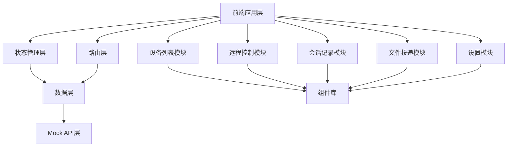

# 远程桌面值守桌面客户端 - 技术架构文档

## 1. 架构设计



### 分层架构

| 层级 | 职责 | 技术实现 |
|------|------|---------|
| 应用层 | UI展示、用户交互 | React 组件 |
| 状态管理层 | 全局状态管理 | React Context + useReducer |
| 数据层 | 数据请求、缓存 | Custom Hooks |
| Mock API层 | 模拟后端接口 | LocalStorage + Mock数据 |

## 2. 技术栈说明

- **前端框架**：React 18
- **样式方案**：Tailwind CSS 3
- **构建工具**：Vite
- **路由管理**：React Router v6
- **图标库**：Lucide React
- **状态管理**：React Context API
- **数据持久化**：LocalStorage

### 项目初始化
使用 vite-init 工具初始化项目：
```bash
npm create vite@latest . -- --template react
```

## 3. 路由定义

| 路由 | 页面 | 功能描述 |
|------|------|---------|
| / | 首页/设备列表 | 默认进入设备列表页面 |
| /devices | 设备列表 | 设备管理、筛选、连接 |
| /remote/:id | 远程控制 | 指定设备的远程控制 |
| /remote | 远程控制 | 从设备列表跳转进入远程控制 |
| /sessions | 会话记录 | 查看历史会话记录 |
| /files | 文件投递 | 文件上传、投递管理 |
| /settings | 系统设置 | 配置管理 |

## 4. 组件结构

### 4.1 布局组件
```
Layout
├── Sidebar (侧边导航)
├── Header (顶部导航)
└── MainContent (主内容区)
```

### 4.2 页面组件
```
Pages
├── DeviceList
│   ├── DeviceFilter
│   ├── DeviceCard
│   └── DeviceGrid
├── RemoteControl
│   ├── ScreenViewer
│   ├── ControlToolbar
│   ├── ScreenshotTool
│   └── ClipboardSync
├── SessionRecord
│   ├── SessionList
│   ├── SessionDetail
│   └── SessionStats
├── FileDelivery
│   ├── FileUploader
│   ├── FileList
│   └── SendHistory
└── Settings
    ├── SecuritySettings
    ├── ConnectionSettings
    └── SystemSettings
```

## 5. 数据模型

### 5.1 设备模型
```typescript
interface Device {
  id: string;
  name: string;
  ipAddress: string;
  storeId: string;
  storeName: string;
  status: 'online' | 'offline' | 'busy';
  remark: string;
  lastSeen: string;
  screens: Screen[];
}

interface Screen {
  id: string;
  name: string;
  width: number;
  height: number;
}
```

### 5.2 会话记录模型
```typescript
interface Session {
  id: string;
  deviceId: string;
  deviceName: string;
  operator: string;
  startTime: string;
  endTime: string;
  duration: number;
  status: 'completed' | 'failed' | 'rejected';
  tags: string[];
  remark: string;
}
```

### 5.3 文件投递模型
```typescript
interface FileTransfer {
  id: string;
  fileName: string;
  fileSize: number;
  fileType: string;
  targetDevices: string[];
  status: 'pending' | 'uploading' | 'sending' | 'completed' | 'failed';
  uploadProgress: number;
  sendProgress: number;
  createTime: string;
}
```

### 5.4 设置模型
```typescript
interface Settings {
  security: {
    tempAuthCode: string;
    authCodeExpiry: string;
    unattendedMode: boolean;
    blacklist: string[];
  };
  connection: {
    timeoutReminder: number;
    confirmSensitiveOps: boolean;
  };
  notification: {
    soundEnabled: boolean;
    desktopNotifications: boolean;
  };
}
```

## 6. Mock API 设计

### 6.1 设备相关
```typescript
// 获取设备列表
GET /api/devices
Response: { devices: Device[] }

// 获取单个设备
GET /api/devices/:id
Response: Device

// 更新设备备注
PUT /api/devices/:id
Request: { remark: string }
Response: Device

// 连接设备
POST /api/devices/:id/connect
Response: { sessionId: string }
```

### 6.2 会话相关
```typescript
// 获取会话列表
GET /api/sessions
Query: { startDate?, endDate?, operator?, tags? }
Response: { sessions: Session[] }

// 获取会话详情
GET /api/sessions/:id
Response: Session

// 创建会话记录
POST /api/sessions
Request: Session
Response: Session

// 更新会话记录
PUT /api/sessions/:id
Request: Partial<Session>
Response: Session
```

### 6.3 文件相关
```typescript
// 上传文件
POST /api/files/upload
Request: FormData
Response: FileTransfer

// 投递文件到设备
POST /api/files/deliver
Request: { fileId: string, deviceIds: string[] }
Response: FileTransfer[]

// 获取文件列表
GET /api/files
Response: { files: FileTransfer[] }
```

## 7. 状态管理设计

使用 React Context 进行全局状态管理：

### 7.1 DeviceContext
- 设备列表数据
- 当前选中设备
- 筛选条件
- 连接状态

### 7.2 SessionContext
- 会话记录列表
- 当前会话详情
- 筛选条件

### 7.3 FileContext
- 上传队列
- 发送历史
- 当前进度

### 7.4 SettingsContext
- 所有配置项
- 配置更新方法

## 8. 目录结构

```
src/
├── components/
│   ├── Layout/
│   │   ├── Sidebar.jsx
│   │   ├── Header.jsx
│   │   └── MainLayout.jsx
│   ├── DeviceList/
│   │   ├── DeviceFilter.jsx
│   │   ├── DeviceCard.jsx
│   │   └── DeviceGrid.jsx
│   ├── RemoteControl/
│   │   ├── ScreenViewer.jsx
│   │   ├── ControlToolbar.jsx
│   │   ├── ScreenshotTool.jsx
│   │   └── ClipboardSync.jsx
│   ├── SessionRecord/
│   │   ├── SessionList.jsx
│   │   ├── SessionDetail.jsx
│   │   └── SessionStats.jsx
│   ├── FileDelivery/
│   │   ├── FileUploader.jsx
│   │   ├── FileList.jsx
│   │   └── SendHistory.jsx
│   └── Settings/
│       ├── SecuritySettings.jsx
│       ├── ConnectionSettings.jsx
│       └── SystemSettings.jsx
├── contexts/
│   ├── DeviceContext.jsx
│   ├── SessionContext.jsx
│   ├── FileContext.jsx
│   └── SettingsContext.jsx
├── hooks/
│   ├── useDevices.js
│   ├── useSessions.js
│   ├── useFiles.js
│   └── useSettings.js
├── pages/
│   ├── DeviceListPage.jsx
│   ├── RemoteControlPage.jsx
│   ├── SessionRecordPage.jsx
│   ├── FileDeliveryPage.jsx
│   └── SettingsPage.jsx
├── services/
│   └── mockApi.js
├── data/
│   └── mockData.js
├── styles/
│   └── index.css
├── App.jsx
└── main.jsx
```

## 9. 关键技术实现

### 9.1 远程控制模拟
由于是前端项目，远程控制功能通过模拟实现：
- 屏幕显示使用预设的模拟图片
- 控制操作记录到会话日志
- 清晰度切换模拟不同画质效果

### 9.2 文件处理
- 使用 File API 实现拖拽上传
- 文件存储使用 IndexedDB
- 模拟投递进度更新

### 9.3 数据持久化
- 使用 LocalStorage 存储：
  - 设备列表
  - 会话记录
  - 文件信息
  - 用户设置
- 数据初始化时从 LocalStorage 读取
- 状态变更时自动保存到 LocalStorage

## 10. 性能优化策略

1. **组件懒加载**：使用 React.lazy 实现页面级代码分割
2. **状态优化**：合理使用 useMemo 和 useCallback
3. **列表虚拟化**：设备列表超过100项时使用虚拟滚动
4. **缓存策略**：常用数据缓存到 Context，避免重复计算
5. **按需渲染**：只在必要时更新组件

## 11. 可访问性要求

- 所有交互元素支持键盘操作
- 颜色对比度符合 WCAG 2.1 AA 标准
- 表单元素有正确的标签关联
- 状态变化有清晰的视觉和文本提示
- 支持屏幕阅读器导航
